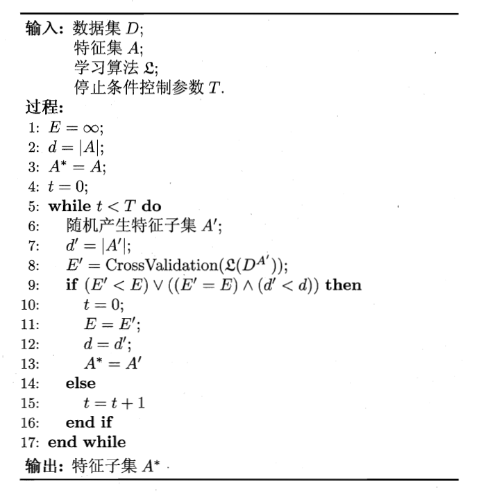

# C11-特征选择与稀疏学习
## 11.1 子集搜索与评价
* 属性又被称为特征(feature)，对当前学习任务有用的属性称为相关属性(relevant feature)，没什么用的属性称为无关属性(irrelevant feature)，从给定的特征集合中选择出相关特征子集的过程称为特征选择(feature selection)。特征选择是一个重要的**数据预处理**(data preprocessing)过程，在现实机器学习任务中，获得数据之后通常先进行特征选择，此后再训练学习器
* 特征选择的原因有二，（1）减轻维数灾难，与降维有相似的动机。事实上，这也是处理高维数据的两大主流技术。（2）去除不相关特征往往会降低学习任务的难度
* 对于子集搜索(subset search)问题，一种是在上一轮最优候选的基础上逐渐增加相关特征的策略称为前向(forward)搜索，类似的，可以从完整的特征集合开始，每次尝试去掉一个无关特征，这样逐渐减少特征的策略称为后向(backward)策略，还可以将两者结合起来，构成双向(bidirectional)搜索。这些策略是贪心的，若不使用穷举搜索，这样的问题将无法避免
* 对于子集评价(subset evaluation)环节，一般可以使用信息增益来作为评价准则，也可以使用任何能判断两个划分差异的机制。
* 将子集搜索和子集评价的机制相结合，即可得到特征选择方法。决策树可用于特征选择，树结点的划分属性所组成的集合就是选择出的特征子集
* 常见的特征选择方法大致可分为三类：过滤式(filter)、包裹式(wrapper)、嵌入式(embedding)。
## 11.2 过滤式选择
* 过滤式方法先对数据集进行特征选择，然后再训练学习器，特征选择过程与后续学习器无关
* Relief方法是一种著名的过滤式特征选择方法，该方法设计了一个相关统计量来度量特征的重要性。该统计量是一个向量，其每个分量分别对应一个初始特征，而特征子集的重要性则是由子集中每个特征所对应的相关统计量分量之和来决定。
* 确定相关统计量：给定训练集\\(\lbrace(\vec{x} _1,y _1),(\vec{x} _2,y _2),\cdots,(\vec{x} _m,y _m)\rbrace\\)，对每个实例\\(\vec{x} _i\\)，Relief先在\\(\vec{x} _i\\)的同类样本中寻找其最近邻\\(\vec{x} _{i,nh}\\)，称为猜中近邻(near-hit)，再从\\(\vec{x} _i\\)的异类样本中寻找其最近邻\\(\vec{x} _{i,nm}\\)，称为猜错近邻(near-miss)，然后，相关统计量对应于属性*j*的分量
\begin{aligned}
\delta^j=\sum _{i}-diff(x _i^j,x _{i,nh}^j)^2+diff(x _i^j,x _{i,nm}^j)^2
\end{aligned}
其中\\(x _a^j\\)表示样本\\(\vec{x} _a\\)在属性*j*上取值，若属性*j*为离散型，则\\(x _a^j=x _b^j\\)时，\\(diff(x _a^j,x _b^j)=0\\)，否则为1；若属性*j*为连续型，则\\(diff(x _a^j,x _b^j)=|x _a^j-x _b^j|\\)，注意，\\(x _a^j,x _b^j\\)已经归一化到[0,1]区间。最后基于不同样本得到的估计结果进行平均，就得到各属性的相关统计量分量，分量值越大，则对应属性的分类能力也就越强
* 对于多分类问题，扩展变体Relief-F，对于每个异类属性，都需要取一个猜错近邻\\(x _{i,l,nm}^j\\)，有
\begin{aligned}
\delta^j=\sum _i-diff(x _i^j,x _{i,nh}^j)^2+\sum _{l\ne k}diff(x _i^j,x _{i,l,nm}^j)^2p _l
\end{aligned}
其中\\(p _l\\)为第*l*类样本在数据集*D*中所占的比例
## 11.3 包裹式选择
* 包裹式特征选择直接把最终将要使用的学习器性能作为特征子集的评价准则
* 一般而言，包裹式选择针对给定学习器进行优化，效果和性能更好，但是另一方面，由于特征选择过程中需要多次训练学习器，因此包裹式特征选择的计算开销通常比过滤式特征选择大得多
* LVW(Las Vegas Wrapper)

由于LVW算法中特征子集的搜索采用了随机策略，而每次特征子集的评价都需要训练学习器，因此算法开销很大。
## 11.4 嵌入式选择与\\(L _1\\)正则化
* 嵌入式选择是将特征选择过程与学习器训练过程融为一体，两者在同一个优化过程中完成，即在学习器训练过程中自动地进行了特征选择
* \\(L _1\\)范数与\\(L _2\\)范数都有利于降低过拟合风险，但是前者更容易获得稀疏解，即它求得的\\(\vec{\omega}\\)会有更少的非零分量
* LASSO
\begin{aligned}
min _{\vec{\omega}}\sum _{i=1}^m(y _i-\vec{\omega}^T\vec{x} _i)^2+\lambda||\vec{\omega}|| _1
\end{aligned}
* 注意到\\(\vec{\omega}\\)取得稀疏解就意味着初始的特征中只有对应\\(\vec{\omega}\\)的非零分量才会出现在最终模型中。基于\\(L _1\\)正则化的学习方法就是一种嵌入式特征选择方法
* \\(L _1\\)正则化问题的求解可使用近端梯度下降(Proximal Gradient Descent, PGD)。具体来说，令\\(\nabla\\)表示微分算子，对优化目标
\begin{aligned}
min _{\vec{x}}f(\vec{x})+\lambda||\vec{x}|| _1
\end{aligned}
若\\(f(\vec{x})\\)可导，且\\(\nabla f\\)满足*L-Lipschitz*条件，即存在常数\\(L>0\\)使得
\begin{aligned}
||\nabla f(\vec{x}')-\nabla f(\vec{x})|| _2^2\le L||\vec{x}'-\vec{x}|| _2^2\quad \forall\vec{x},\vec{x}'
\end{aligned}
则在\\(\vec{x} _k\\)附近可将\\(f(\vec{x})\\)通过二阶泰勒展开式近似为
\begin{aligned}
\hat{f}\vec{x}&\simeq f(\vec{x} _k)+<\nabla f(\vec{x} _k),\vec{x}-\vec{x} _k>+\frac{L}{2}||\vec{x}-\vec{x} _k|| _2^2\\\\
&=\frac{L}{2}||\vec{x}-(\vec{x} _k-\frac{1}{L}\nabla f(\vec{x} _k))|| _2^2+const
\end{aligned}
最小值在如下\\(\vec{x} _{k+1}\\)获得：
\begin{aligned}
\vec{x} _{k+1}=\vec{x} _k-\frac{1}{L}\nabla f(\vec{x} _k)
\end{aligned}
每一步的迭代为
\begin{aligned}
\vec{x} _{k+1}=argmin _{\vec{x}}\frac{L}{2}||\vec{x}-(\vec{x} _k-\frac{1}{L}\nabla f(\vec{x} _k))|| _2^2+\lambda||\vec{x}|| _1
\end{aligned}
即在每一步对\\(f(\vec{x})\\)进行梯度下降迭代的同时考虑\\(L _1\\)范数最小化
* 对上式，可先计算\\(\vec{z}=\vec{x} _k-\frac{1}{L}\nabla f(\vec{x} _k)\\)，然后求解
\begin{aligned}
\vec{x} _{k+1}=argmin _{\vec{x}}\frac{L}{2}||\vec{x}-\vec{z}|| _2^2+\lambda||\vec{x}|| _1
\end{aligned}
令\\(x^i\\)表示\\(\vec{x}\\)的第*i*个分量，得到闭式解
\begin{aligned}
x _{k+1}^i=
\begin{cases}
&z^i-\lambda/L,\quad &\lambda/L<z^i\\\\
&0,&|z^i|\le\lambda/L\\\\
&z^i+\lambda/L,&z^i<-\lambda/L
\end{cases}
\end{aligned}
## 11.5 稀疏表示与字典学习
* 当样本具有稀疏表达式时，对学习任务来说会有不少好处，比如线性支持向量机之所以能在文本数据上有很好的性能，恰恰是由于文本数据在使用字频表示后具有高度的稀疏性，使得大多数问题线性可分。同时稀疏样本并不会造成存储上的巨大负担，因为稀疏矩阵已有非常多高效的存储方法
* 稀疏需要的是适度稀疏，而不是过度稀疏，过度稀疏也许并未给学习任务带来更多的好处
* 为一般的学习任务和普通的稠密表达的样本找到合适的字典，将样本转化为合适的稀疏表示形式，从而使学习任务得以简化，模型复杂度降低，通常称为字典学习(dictionary learning)，也叫作稀疏编码(sparse coding)
* 给定数据集\\(D=\lbrace\vec{x} _1,\vec{x} _2,\cdots,\vec{x} _m\rbrace\\)，字典学习的最简单形式为
\begin{aligned}
min _{\matrix{B},\vec{\alpha} _i}\sum _{i=1}^m||\vec{x} _i-\matrix{B}\vec{\alpha} _i|| _2^2+\lambda\sum _{i=1}^m||\vec{\alpha} _i|| _1
\end{aligned}
其中，\\(\matrix{B}\in\mathbb{R}^{d\times k}\\)为字典矩阵，*k*为字典的词汇量，通常由用户指定，\\(\vec{\alpha} _i\\)则是样本\\(\vec{x} _i\in\mathbb{R}^d\\)的稀疏表示。可采用变量交替优化的策略来求解。
* 第一步，固定\\(\matrix{B}\\)，参考LASSO的解法求解下式，从而为每个样本找到对应的\\(\alpha _i\\)
\begin{aligned}
min _{\vec{\alpha} _i}||\vec{x} _i-\matrix{B}\vec{\alpha} _i|| _2^2+\lambda||\vec{\alpha} _i|| _1
\end{aligned}
第二步，以\\(\vec{\alpha} _i\\)为初值来更新字典\\(\matrix{B}\\)，即
\begin{aligned}
min _{\matrix{B}}||\matrix{X}-\matrix{B}\matrix{A}|| _F^2
\end{aligned}
其中\\(\matrix{X}=(\vec{x} _1,\vec{x} _2,\cdots,\vec{x} _m)\in\mathbb{R}^{d\times m},\matrix{A}=(\vec{\alpha} _1,\vec{\alpha} _2,\cdots,\vec{\alpha} _m)\in\mathbb{R}^{k\times m}\\)，常用的求解办法有基于逐列更新策略的KSVD
\begin{aligned}
min _{\matrix{B}}||\matrix{X}-\matrix{B}\matrix{A}|| _F^2 &=min _{\vec{b} _i}||\matrix{X}-\sum _{j=1}^k\vec{b} _j\vec{\alpha}^j|| _F^2\\\\
&=min _{\vec{b} _i}||(\matrix{X}-\sum _{j\ne i}\vec{b} _j\vec{\alpha}^j)-\vec{b} _i\vec{\alpha}^i|| _F^2\\\\
&=min _{\vec{b} _i}||\matrix{E} _i-\vec{b} _i\vec{\alpha}^i|| _F^2
\end{aligned}

## 11.6 压缩感知(compressed sensing)